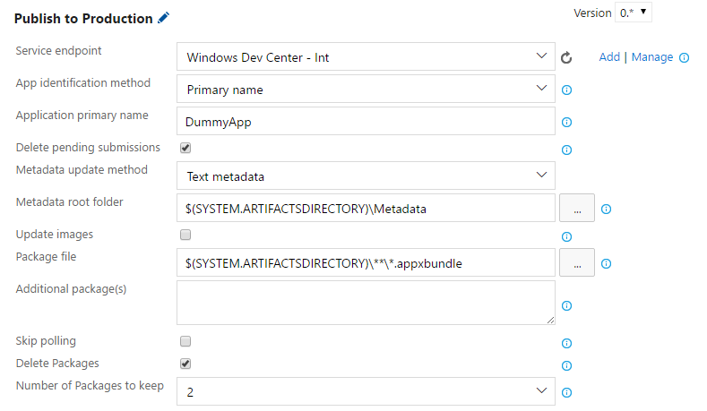

# Visual Studio Team Services extension for the Windows Store 

This extension provides tasks to automate the release of your Windows apps to the Windows Store from your continuous integration environment in Visual Studio Team Services (VSTS). You no longer need to manually update your apps from Windows Dev Center. 

## Quick start

1. Ensure you meet the [prerequistes](#prerequisites).

2. [Install](https://marketplace.visualstudio.com/items?itemName=MS.RDX.MRO.windows-store-publish) the extension.

3. [Obtain](#obtaining-your-credentials) and [configure](#configuring-your-credentials) your Dev Center credentials.

4. [Add tasks](#task-reference) to your release definitions.

## Prerequisites 

1. You must have an Azure AD directory, and you must have [global administrator permission](https://azure.microsoft.com/en-us/documentation/articles/active-directory-assign-admin-roles/) for the directory. You can create a new Azure AD [from Dev Center](https://msdn.microsoft.com/windows/uwp/publish/manage-account-users). 

2. You must associate your Azure AD directory with your Dev Center account to obtain the credentials to allow this extension to access your account and perform actions on your behalf. 

3. The app you want to publish must already exist: this extension can only publish updates to existing applications. You can [create your app in Dev Center](https://msdn.microsoft.com/windows/uwp/publish/create-your-app-by-reserving-a-name). 

4. You must have already [created at least one submission](https://msdn.microsoft.com/windows/uwp/publish/app-submissions) for your app before you can use the Publish task provided by this extension. If you have not created a submission, the task will fail. 

## Obtaining your credentials 

Your credentials are comprised of three parts: the Azure **Tenant ID**, the **Client ID** and the **Client secret**. 
Follow these steps to obtain them: 

1. In Dev Center, go to your **Account settings**, click **Manage users**, and associate your organization's Dev Center account with your organization's Azure AD directory. For detailed instructions, see [Manage account users](https://msdn.microsoft.com/windows/uwp/publish/manage-account-users).

2. In the **Manage users** page, click **Add Azure AD applications**, add the Azure AD application that represents the app or service that you will use to access submissions for your Dev Center account, and assign it the **Manager** role. If this application already exists in your Azure AD directory, you can select it on the **Add Azure AD applications** page to add it to your Dev Center account. Otherwise, you can create a new Azure AD application on the **Add Azure AD applications** page. For more information, see [Add and manage Azure AD applications](https://msdn.microsoft.com/windows/uwp/publish/manage-account-users#add-and-manage-azure-ad-applications). 

3. Return to the **Manage users** page, click the name of your Azure AD application to go to the application settings, and copy the **Tenant ID** and **Client ID** values. 

4. Click **Add new key**. On the following screen, copy the **Key** value, which corresponds to the **Client secret**. You *will not* be able to access this info again after you leave this page, so make sure to not lose it. For more information, see the information about managing keys in [Add and manage Azure AD applications](https://msdn.microsoft.com/windows/uwp/publish/manage-account-users#add-and-manage-azure-ad-applications). 
 
## Configuring your credentials 
 
Once you have obtained your credentials, you must configure them in VSTS so that the extension can access your Dev Center account and publish on your behalf. You must install the extension before being able to configure your credentials. Once the extension is installed, follow these steps: 
 
1. In VSTS, select your project and go to the **Project settings** page. Click the **Services** tab. Expand the **New Service endpoint** dropdown, and select **Windows Dev Center**

2. In the pop-up box, fill in your credentials in the corresponding text boxes (**Azure Tenant ID**, **Client ID** and **Client Secret**). For the **Connection Name**, you can pick any name of your choosing. For the **Server URL**, use the default value "<https://manage.devcenter.microsoft.com/>". 
 

 
3. Click **OK** to confirm. Your endpoint is now configured and will be accessible by the extension's tasks. 

## Using the extension 
 
This extension provides release tasks. You can access them from your project by clicking the **Release** tab, and selecting an existing release definition or [creating one](https://www.visualstudio.com/en-us/docs/release/author-release-definition/more-release-definition). Select your chosen environment, then click **Add tasks**. The tasks contributed by this extension are in the **Deploy** section.


## Task reference 
 
### Windows Store - Publish 
 
This task allows you to publish your app on the Store by creating a submission on Dev Center. It has the following parameters:


 
* Service endpoint - The endpoint containing the credentials you wish to use. Typically this will be the endpoint you created when [configuring your credentials](#configuring-your-credentials). 

* App identification method - How to identify the app to publish: by name or ID. If unsure, select "Primary name". 

* Application primary name / ID (*Text, required*) - The identification for the app. Depending on your selection, this should be either the app ID (visible in the URL of the app's page on Dev Center) or the app primary name (visible on the app's page on Dev Center).

* Force (*Checkbox*) - If checked, will attempt to delete any in-progress submission before starting a new one. Note that only one submission at a time can be pending. Therefore, if this box is not checked and a submission is already pending, the task will fail. Furthermore, submissions created on the Dev Center UI cannot be deleted automatically by the task. 
 
* Metadata update method - How to update the app's metadata. Options are *No Update*, *Text Metadata* or *JSON-formatted Metadata*. In the first case, the app's metadata will not be changed from the previous submission. In the latter cases, the app's metadata will be updated according to the [expected format](#metadata-format). 
 
* Metadata path (*File path, required if visible*) - Path to a directory containing the metadata to update (appears when selecting another option than *No Update* for the metadata update method). The expected format is detailed [below](#metadata-format). 
 
* Package path (*File path, optional*) - Path to your app's main package (usually a file in .appx, .xap or .appxbundle format).
 
* Additional package(s) (*Text, optional*) - A list of paths, one per line, of additional packages that your app needs, for example to support multiple platforms. 

You only have to select the packages you want to update. If you have a package that will not be updated as part of your release, you do not have to specify it.
 
#### Metadata format 
 
The metadata format for the Publish task is as follows: 
 
``` 
$(Metadata path) 
└ $(language codes)    (e.g. en-us) 
  ├ baseListing 
  | ├ metadata.json  OR  $(attribute).txt 
  | └ images 
  |   └ $(image type)    (e.g. MobileScreenshot) 
  |     ├ $(image).png 
  |     └ $(image).json  OR  $(attribute).$(image).txt 
  └ platformOverrides  (optional) 
    └ $(platform)    (e.g. Windows81) 
      └ (Same structure as under 'baseListing') 
``` 

[Examples](#metadata-structure-example) are available below. 

If the **Metadata update method** parameter is set to *Text Metadata*, text files are expected. If it is set to *JSON-formatted Metadata*, then JSON files are expected.

If text files are expected, then there should be one text file per metadata attribute that you wish to update, and it should have the same name as the attribute in question. For string attributes, the entire file contents will be used as-is. For array attributes (e.g. keywords, hardware capabilities), each non-empty line will be considered as an element of the array. 

If JSON files are expected, then each JSON file must contain an object which has the attributes that you wish to update. 

Metadata from the previous submission is always preserved if it is not present in the provided folder. For example, if you do not provide a "description.txt" file in your listing, the description will remain the same as it was in the last submission. 

You can find the list of accepted attributes for the language code listings [here](https://msdn.microsoft.com/en-us/windows/uwp/monetize/manage-app-submissions#base-listing-object). Note that the task will automatically set the ```images``` attribute for you based on the file structure you provide, so you should not specify it as it will be overridden.  

You can find the list of accepted names for platform overrides [here](https://msdn.microsoft.com/en-us/windows/uwp/monetize/manage-app-submissions #listing-object).  

In the case of images, images from the previous submission are deleted, and must therefore be supplied again. Accepted attributes for the images can be found [here](https://msdn.microsoft.com/en-us/windows/uwp/monetize/manage-app-submissions#image-object). Note that the task will
automatically set the ```fileName```, ```fileStatus```, ```id``` and ```imageType``` attributes for you, so you should not specify them as they will be overridden. The ```imageType``` attribute will correspond to the name of the folder in which your image is placed. The list of accepted image types can be found [here](https://msdn.microsoft.com/en-us/windows/uwp/monetize/manage-app-submissions#image-object). 

The Store only supports images in PNG format. If you include images in any other format, they will be ignored. 

#### Metadata structure example 

Here are two examples of metadata structures, one for JSON attributes and one for text attributes.

``` 
appMetadata 
├ en-us 
| ├ baseListing 
| | ├ metadata.json  
| | └ images 
| |   └ Screenshot 
| |     ├ mainScreenshot.png 
| |     ├ mainScreenshot.json 
| |     ├ controls.png 
| |     └ controls.json 
| └ platformOverrides   
|   └ Windows80 
|     └ metadata.json 
├ cs-cz 
| └ platformOverrides 
|   └ WindowsPhone71 
|     └ images 
|       └ Icon 
|         ├ czIcon.png 
|         └ czIcon.json 
└ fr-ca 
  └ baseListing 
    └ metadata.json 
``` 

``` 
appMetadata 
├ en-us 
| ├ baseListing 
| | ├ description.txt  
| | ├ features.txt 
| | ├ keywords.txt 
| | └ images 
| |   └ Screenshot 
| |     ├ mainScreenshot.png 
| |     ├ description.mainScreenshot.txt 
| |     ├ controls.png 
| |     └ description.controls.txt 
| └ platformOverrides 
|   └ Windows80 
|     ├ description.txt 
|     └ releaseNotes.txt  
├ cs-cz 
| └ platformOverrides 
|   └ WindowsPhone71 
|     └ images 
|       └ Icon 
|         ├ czIcon.png 
|         └ description.czIcon.txt  
└ fr-ca 
  └ baseListing 
    └ features.txt
``` 

## Contact us 

If you have questions, send us an email [here](mailto:wdcrsppt@microsoft.com).

[Click here](https://github.com/Microsoft/windows-dev-center-vsts-extension/issues) to report a bug or make a suggestion.
