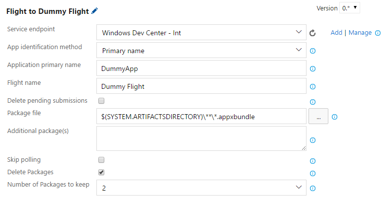

# Usage

> [!CAUTION]
> **Do not use the V3 versions of those tasks!**
> 
> They are using a non-public API (see https://github.com/microsoft/windows-dev-center-vsts-extension/issues/124)

## Adding extension to the pipeline
This extension provides tasks for build and release pipelines. You can access them from your project by clicking "Builds" or "Releases" under the **Pipelines** section on the left menu, and selecting an existing pipeline, or [creating a new one](https://docs.microsoft.com/en-us/azure/devops/pipelines/release/define-multistage-release-process?view=vsts).

1. Click on the **Edit pipeline** tab. </br>
    

2. Select the stage where to add the task </br>
    

3. Then click **Add tasks**. </br>
    

4. The tasks contributed by this extension are in the **Build** and **Deploy** sections.

## Task reference
This document focuses on explaining the v2.\* tasks. For v0.\* tasks, see previous [tag](https://github.com/Microsoft/windows-dev-center-vsts-extension/tree/0.9.27#task-reference).

This extension exposes four different tasks to publish your app into the Windows Store.

- **[Windows Store - Publish](#windows-store---publish)** - Publishes your app to production or flight tracks.

- **[Windows Store - Flight](#windows-store---flight)** - Same as the publish task. Publishes your app to production or flight tracks (Kept for backward compatibility).

- **[Windows Store - Rollout](#windows-store---rollout)** - Modifies an existing rollout on a store submission of your app (flight or production).

- **[Windows Store - Package](#windows-store---package)** - Creates a Store Broker submission package to use with the Publish task.

### Windows Store - Publish

This task allows you to publish your app on the Store by creating a submission on Dev Center. It has the following parameters:


* **Display name** - The name that will appear in the pipeline.

* **Service endpoint** - The endpoint containing the credentials you wish to use. Typically this will be the endpoint you created when [configuring your credentials](./setup.md#Configuring-your-credentials).

* **App identification method** - How to identify the app to publish: by name or ID. If unsure, select "Primary name".

* **Application primary name / ID (*Text, required*)** - The identification for the app. Depending on your selection, this should be either the app ID (visible in the URL of the app's page on Dev Center) or the app primary name (visible on the app's page on Dev Center).

* **Track (*v2.\** only)** - The track you are trying to publish to. It can be *Flight* or *Production*. The default for this task is *Production*

* **Input Method** - The input method for the submission. You can either  use the [Windows Store Package](#windows-store---Package) task to build your [Store Broker payload](https://github.com/Microsoft/StoreBroker/blob/v2/Documentation/USAGE.md#creating-your-application-payload) and provide the generated Json and Zip files to this publishing task, or provide plain packages directly.

  * *Json & Zip*
    When selecting the Jzon and Zip input method, the following parameters can be provided:

    

    * **JSON Path** - The path to the JSon file generated by the [Package](#windows-store---Package) task.

    * **Zip Path** - The path to the Zip file generated by the [Package](#windows-store---Package) task.

    * **Update Publish Mode and Visibility** - This will change the `targetPublishMode`, `targetPublishDate`, and `visibility` of the cloned submission to that which is specified in your json. Without doing this, keep in mind that your new submission will publish the same way as your previous submission (be that immediately, manual or time based). [More info](https://github.com/Microsoft/StoreBroker/blob/v2/Documentation/USAGE.md#the-easy-way)

    * **Update Pricing and Availability** - This will change the `pricing`, `allowTargetFutureDeviceFamilies`, `allowMicrosoftDecideAppAvailabilityToFutureDeviceFamilies`, and `enterpriseLicensing` of the cloned submission to that which is specified in your json. [More info](https://github.com/Microsoft/StoreBroker/blob/v2/Documentation/USAGE.md#the-easy-way)

    * **Update App Properties** - This will change the `applicationCategory`, `hardwarePreferences`, `hasExternalInAppProducts`, `meetAccessibilityGuidelines`, `canInstallOnRemovableMedia`, `automaticBackupEnabled`, and `isGameDvrEnabled` of the cloned submission to that which is specified in your json. [More info](https://github.com/Microsoft/StoreBroker/blob/v2/Documentation/USAGE.md#the-easy-way)

    * **Update Gaming Options** - This will update all values under the `gamingOptions` node specified in your json. [More info](https://github.com/Microsoft/StoreBroker/blob/v2/Documentation/USAGE.md#the-easy-way)

    * **Update Notes for Certification** - This will change the `notesForCertification` field of the cloned submission to that which is specified in your json. [More info](https://github.com/Microsoft/StoreBroker/blob/v2/Documentation/USAGE.md#the-easy-way)

    * **Update Metadata** - Selecting this will show four new options described in the [metadata update](#metadata-update) section

    * **Delete pending submissions** - If checked, will attempt to delete any in-progress submission before starting a new one. Note that only one submission at a time can be pending. Therefore, if this box is not checked and a submission is already pending, the task will fail. Furthermore, submissions created on the Dev Center UI cannot be deleted automatically by the task.

  * *Packages*
    When selecting the packages input method, you can specify any file supported by the store and upload it directly with the following parameters:

    

    * **Source Folder** - The source folder of the packages that the publishing task consume

    * **Contents** - App packages that are part of the submission. Provide the relative path of the packages with respect to the source folder.

    * **Delete pending submissions** - If checked, will attempt to delete any in-progress submission before starting a new one. Note that only one submission at a time can be pending. Therefore, if this box is not checked and a submission is already pending, the task will fail. Furthermore, submissions created on the Dev Center UI cannot be deleted automatically by the task.

    * **Sparse Bundle** - Whether the app being submitted is a sparse bundle or not.

    * **Metadata update method** - How to update the app's metadata. Options are *No Update* and *Folder Structure*. In the former, the app's metadata will not be changed from the previous submission. In the latter, the app's metadata will be updated according to the [expected format](#metadata-format).

    * **Metadata root folder (*required when metadata update method is Folder Structure*)** - Path to a directory containing the metadata to update (appears when selecting another option than *No Update* for the metadata update method). The expected format is detailed [below](#metadata-format).

#### Metadata Update

Whether you are using a Json and Zip, or packages directly to update your app in the Windows Store, you can update its metadata either by selecting the **Update Metadata** checkbox or by selecting *Folder Structure* in the **Metadata Update Method** drop down. The following paramareters will be available regardless of the **Input Method**:


* **Update Text Listing** - If checked, all text listings will be updated by the text provided in this submission (e.g. Release Notes, KeyWords, etc.).

* **Update Images** - If checked, all existing images will be deleted and replaced by the ones provided in this submission.

* **Update Videos** - If checked, all existing trailers will be deleted and replaced by the ones provided in this submissions.

* **Update only specified metadata** - If checked, only the attributes in the languages provided will be updated. For images and videos, all images and videos of the provided languages will be deleted as well. Non provided langauges will be left untouched.

Note that by default, all metadata has to be provided unless the **Update only specified metadata** box is checked. Also note that all images and trailers have to be provided regardless of the selection of **Update only specified metadata** since there is no way to update a particular image. This functionality can remove languages if they are not provided.

##### Metadata format

The metadata format explained below only applies to the *folder structure* option. When using Json and Zip files, it is expected that the Json and zip file contain the information needed to update the metadata of the application.

```
$(Metadata root folder)
├Listings
|   └ $(language codes)         (e.g. en-us)
|       ├ baseListing
|       | ├ $(attribute).txt
|       | └ images
|       |   └ $(image type)     (e.g. MobileScreenshot)
|       |       ├ $(image).png
|       |       └ $(attribute).$(image).txt
|       └ platformOverrides     (optional)
|           └ $(platform)       (e.g. Windows81)
|               └ (Same structure as under 'baseListing')
└Trailers
    └ $(trailerName).mp4
    ├ $(trailerName).trailerAssets
        └ $(language codes)     (e.g. en-us)
            ├ $(attribute).txt  (e.g. title.txt)
            └ images
                ├ $(trailerName)thumbnail.png
                └ $(trailerName)thumbnail.txt
```

[Examples](#metadata-structure-example) are available below.

There should be one text file per metadata attribute that you wish to update, and it should have the same name as the attribute in question. For string attributes, the entire file contents will be used as-is. For array attributes (e.g. keywords, hardware capabilities), each non-empty line will be considered as an element of the array.

By default, metadata from the previous submission will be always overriden. If the **Update only specified metadata** option is checked, metadata from the previous submission will be preserved if it is not present in the provided folder. For example, if you do not provide a "description.txt" file in your listing, the description will remain the same as it was in the last submission.

You can find the list of accepted attributes for the language code listings [here](https://msdn.microsoft.com/en-us/windows/uwp/monetize/manage-app-submissions#base-listing-object). Note that the task will automatically set the ```images``` attribute for you based on the file structure you provide, so you should not specify it as it will be overridden.

You can find the list of accepted names for platform overrides [here](https://msdn.microsoft.com/en-us/windows/uwp/monetize/manage-app-submissions#listing-object).

In the case of images and trailers, the previous submission's files are deleted, and must therefore be supplied again. This behavior is regardless of the option **Update only specfiied metadata**. Accepted attributes for the images can be found [here](https://msdn.microsoft.com/en-us/windows/uwp/monetize/manage-app-submissions#image-object). Note that the task will
automatically set the ```fileName```, ```fileStatus```, ```id``` and ```imageType``` attributes for you, so you should not specify them as they will be overridden. The ```imageType``` attribute will correspond to the name of the folder in which your image is placed. The list of accepted image types can be found [here](https://msdn.microsoft.com/en-us/windows/uwp/monetize/manage-app-submissions#image-object).

The Store only supports images in png format. If you include images in any other format, they will be ignored.

##### Metadata structure example

Here are two examples of metadata structures, one for JSON attributes and one for text attributes.

```
appMetadata
├ Listings
| ├ en-us
| | ├ baseListing
| | | ├ description.txt
| | | ├ features.txt
| | | ├ keywords.txt
| | | └ images
| | |   └ Screenshot
| | |     ├ mainScreenshot.png
| | |     ├ description.mainScreenshot.txt
| | |     ├ controls.png
| | |     └ description.controls.txt
| | └ platformOverrides
| |   └ Windows80
| |     ├ description.txt
| |     └ releaseNotes.txt
| ├ cs-cz
| | └ platformOverrides
| |   └ WindowsPhone71
| |     └ images
| |       └ Icon
| |         ├ czIcon.png
| |         └ description.czIcon.txt
| └ fr-ca
|   └ baseListing
|     └ features.txt
└ Trailers
  ├ trailer1.trailerAssets
  | └ en-us
  |   ├ images
  |   | ├trailer1thumbnail.png
  |   | └trailer1thumbnail.txt
  |   └ title.txt
  ├ trailer2.trailerAssets
  | └ en-us
  |   ├ images
  |   | ├trailer2thumbnail.png
  |   | └trailer2thumbnail.txt
  |   └ title.txt
  ├ trailer1.mp4
  └ trailer2.mp4
```

#### Rollout Options

When you publish an update to a submission, you can choose to gradually roll out the updated packages to a percentage of your app’s customers on Windows 10 (including Xbox). The publish task allows you to create a rollout at the same time you publish your new package(s) with the following parameters:


* **Create Rollout** - Whether or not a rollout should be created at the same time of publishing this update

* **Rollout Percentage (*float*)** - Specifies the percentage of the app's customers that will get the update. It accepts floating-point numbers.

* **Enable Rollout Seek** - Enables rollout seek functionality. When a rollout is created with this option, customers that are not part of the initial percentage you specified can still get the update if they manually check for updates.

See more about package rollouts [here](https://docs.microsoft.com/en-us/windows/uwp/publish/gradual-package-rollout).

#### Advanced Options

There is a set of advanced options you can specify for a particular submission. Default values should work in most cases, but you can tweak these advanced options if you scenario requires it.


* **Skip polling** - If checked, will skip polling the submission after submitting it to Dev Center. Otherwise, it will keep polling the submission until it gets published (which typically takes around 2 hours). **Warning**: If you check this box, you will not see errors, if any, that your submission may run into. You will have to manually check the status of your submission in Dev Center.

* **Delete Packages** - If checked, will enable deletion of one or more old packages (sorted by version). Checking this box will enable a dropdown "Number of packages to keep" explained in following point. If not checked, will not delete any old packages. Note that the store has a limit of 25 packages per track. When reaching this point, you won't be able to upload new pacakges until older ones are deleted. 

* **Number of Packages to keep** - Specify number of latest packages (sorted by version) to be kept per unique target device family, OS platform. For example, if you have a mix of 3 distinct packages each for Windows 10 desktop, mobile and Windows 8.1 X64 platform (so in total 9 packages), and you specify 2 in this box, then the oldest package in each group will be deleted (total packages after deletion will be 6), assuming you are providing one package for each group in this submission.

* **Target Publish Mode** - Indicates how the submission should be published. Setting this to any value other than Default will override the checkbox `Update Publish Mode And Visibility`. Options are `Default`, `Manual`, `Immediate` and `SpecificDate`. [More info](https://github.com/Microsoft/StoreBroker/blob/v2/Documentation/USAGE.md#the-easy-way).

* **Target Publish Date** - The specific date/time that the submission should be published. Using this value will override any value that might have been set by checkbox `Update Publish Mode And Visibility`. Users should provide this in local time and it will be converted automatically to UTC (e.g. 01/30/2019 00:00:00). [More info](https://github.com/Microsoft/StoreBroker/blob/v2/Documentation/USAGE.md#the-easy-way).

* **Visibilty** - Indicates the store visibility of the app once the submission has been published. Setting this to any value other than `Default` will override the checkbox `Update Publish Mode And Visibility`. Options are `Default`, `Public`, `Private` and `StopSelling`. [More info](https://github.com/Microsoft/StoreBroker/blob/v2/Documentation/USAGE.md#the-easy-way).

* **Mandatory Update** - Indicates whether you want to treat the packages in this submission as mandatory for self-installing app updates.

* **Number of hours until packages become mandatory** - The effective time when the packages in this submission become mandatory, in hours from submission time.

* **Preserve Submission ID** - This task will always preserve the Id of the new submission for future tasks in the same job to consume as an output variable with the name *WS_SubmissionID* ([More about output variables](https://github.com/Microsoft/azure-pipelines-agent/blob/master/docs/preview/outputvariable.md#examples)). By checking this, the task will also preserve the ID at the release/build level. To achieve this, the task uses Azure DevOps APIs to modify the release/build in the server side. When you enable this, you should also enable the option to *Allow Scripts to Access OAuth Token* at the agent level ([See more on how to do this here](https://docs.microsoft.com/en-us/azure/devops/pipelines/scripts/powershell?view=vsts#use-the-oauth-token-to-access-the-rest-api)). 

  **Warning** This is a very invasive operation, since the task will update the release/build itself to preserve the variable *WS_SubmissionID* accross multiple stages and retries. If the intention is to preserve the submission Id for future tasks in the same stage and agent job, then there is no need for checking this option, since the task will automatically populate the output variable *WS_SubmissionID* ([More about output variables](https://github.com/Microsoft/azure-pipelines-agent/blob/master/docs/preview/outputvariable.md#examples)).

* **Log Path** - The full path for the Store Broker log file. If it doesn't exist, it will be created.

* **Disable Telemetry** - Whether to disable or not the collection of data. See Microsoft's [Privacy Policy](https://privacy.microsoft.com/en-US/privacystatement) and [Terms of Use](https://www.microsoft.com/en-us/legal/intellectualproperty/copyright/default.aspx). For specific information on Store Broker's telemetry, see [Store Broker Telemetry](https://github.com/Microsoft/StoreBroker/blob/v2/Documentation/USAGE.md#telemetry)

### Windows Store - Flight

This task allows you to publish your app to specified flight on the Store by creating a submission on Dev Center. This task has been kept for backward compatibility, but the backend code is the same as the [publish task](#windows-store---publish) above. The **Track** option specifies whether you are publishing to production or to a flight. Same parameters apply except any option for metadata update since metadata updates are not supported by the store in flight submissions. The default value for the **Track** option is *Flight*. Some extra paramaters are explained below



* **Flight Identification Method** - How to identify the flight to publish to: by name or ID. If unsure, select "Primary name". This is the name that shows up for your flight in the Dev Center page

* **Flight ID** - ID the flight that you want to update the submission for. The ID can be found as part of the URL when accessing the properties of the flight in the Dev Center page.

* **Flight Name** - Friendly name of the flight (as seen on the Dev Center) that you want to update the submission for.

### Windows Store - Rollout

The Rollout task allows you to modify an existing package rollout in a store submission, either in production or flight track.

More information about package rollouts [here](https://docs.microsoft.com/en-us/windows/uwp/publish/gradual-package-rollout).


* **Rollout Action** Three possible rollout actions. Set Will adjust the current gradual rollout percentage to the provided percentage. Finalize will finalize the rollout and set the rollout percentage to 100%. Halt will also finish the rollout but will set the rollout percentage to 0%

* **Rollout Value** Choose the rollout percentage value. Valid values are (0.0 - 100.0) exclusive

* **Execute the action only if the current rollout is less than** This field appears when Rollout Action is set to either Finalize or Halt. When Rollout Action is set to 'Finalize', then execute the action only if the current percentage is less than the provided percentage. Otherwise the rollout would halt. If the Rollout Action is set to 'Halt', then execute the action only if the current percentage is less than the provided percentage. Otherwise the rollout would finalize.

#### Advanced Options

There is a set of advanced options you can specify for a particular submission. Default values should work in most cases, but you can tweak these advanced options if you scenario requires it.


* **Current Package Version Regex** Regex representing current package version. Rollout will be done, only if package version in existing rollout in Dev Center matches this regex.

* **Fail if rollout is not in progress** - If checked, this task will fail if no in-progress rollout is found in Dev Center for given app and track.

### Windows Store - Package

The Windows Store Package task has been added in version v2.* and is used to migrate [Store Broker](https://www.nuget.org/packages/Microsoft.Windows.StoreBroker/) users to a CI environment.


* **StoreBroker PDP Root Path** Full Path to the PDP root directory

* **Media Root Path** Full Path to the media root directory

* **StoreBroker Output Path** Output directory where Store Broker will output generated files out of New-SubmissionPackage command. This overrides the value from the config file. More info (https://github.com/Microsoft/StoreBroker/blob/v2/Documentation/SETUP.md#getting-your-pdps)

* **StoreBroker Output Name** The common name to use for the .json/.zip pair. If specified, this overrides the value from the config file.

* **StoreBroker Config File Full Path** Full Path to the StoreBroker Config File. If not specified, it will be generated based on the current Prod submission

* **StoreBroker PDP Release Root Path** Relative path to the correct subfolder within 'PDPRootPath' to find the PDP files to use. If specified, this overrides the value from the config file.

* **PDP Include** List of PDP file names that SHOULD be processed. Each line supports wildcards, eg 'ProductDescription*.xml'. Ex: ".xml.lss", ".xml.lct". Minimatch is not supported. If specified, this overrides the value from the config file.

* **PDP Exclude** List of PDP file names that SHOULD NOT be processed. Each line supports wildcards, eg 'ProductDescription*.xml'. Ex: ".xml.lss", ".xml.lct". Minimatch is not supported. If specified, this overrides the value from the config file.

* **Language Exclude** List of lang-code strings that SHOULD NOT be processed. Each line represents a language code. Ex: "default", "qps-ploc". If specified, this overrides the value from the config file.
